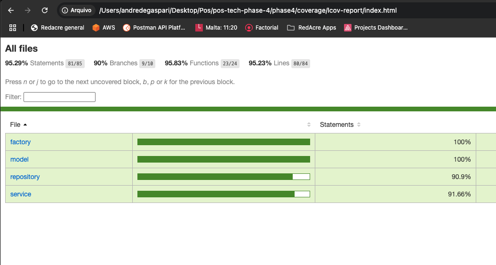
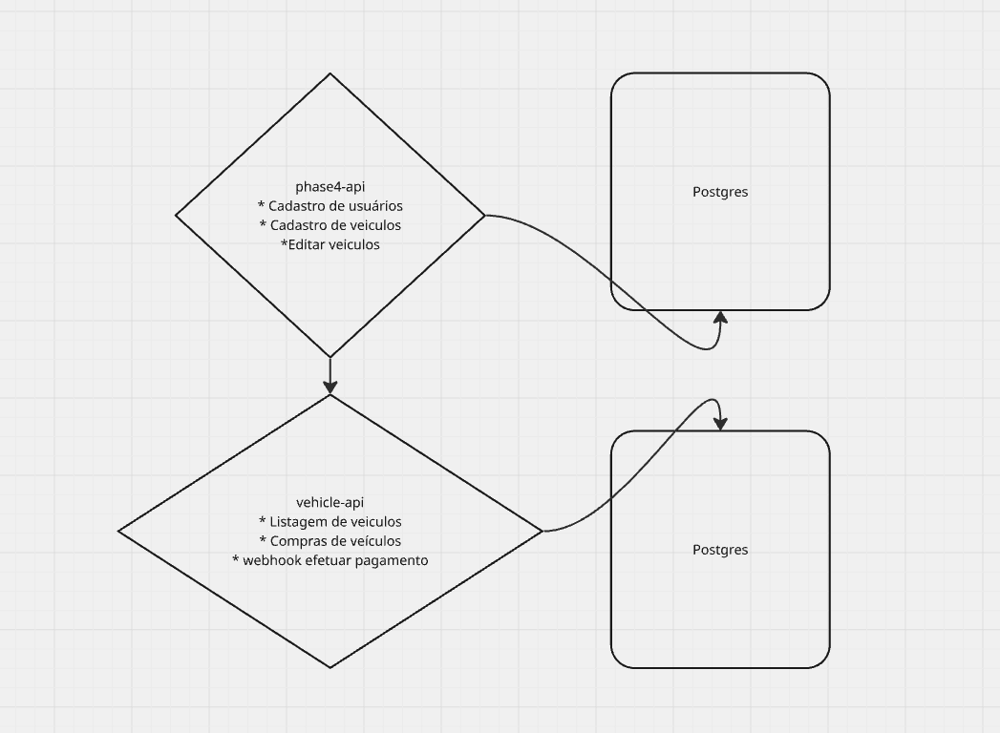

## O que é a phase4 api.

Uma solução que atende as seguintes necessidades de um negócio de venda de carros:

• Cadastrar um veículo para venda (Marca, modelo, ano, cor, preço);
• Editar os dados do veículo;

## Como rodar a aplicação

# Pre requisitos

1 - Docker e docker compose

# Criar network

1 - Rodar o comando abaixo para que os dois microserviços tenham uma network compartilhada:  
docker network create microservices-network

# Rodando a aplicação

1 - Criar um arquivo .env a partir do arquivo .env.example
2 - rodar o comando docker compose up na raiz do projeto

## Curls para teste

# Criar veiculo

curl --location 'http://localhost:3000/vehicles' \
--header 'Content-Type: application/json' \
--data '{
"brand":"Gm",
"model": "Agile",
"year":2014,
"color": "preto",
"price": 30,
"isAvailable": true
}'

# Atualizar veiculo

curl --location --request PATCH 'http://localhost:3000/vehicles' \
--header 'Content-Type: application/json' \
--data '{
"id": "9a0e5418-79c6-455b-b67a-583085a5fa2f",
"brand":"Honda",
"model": "City",
"year":2010,
"color": "red",
"price": 16,
"isAvailable": true
}'

## Coverage

## Arquitetura

